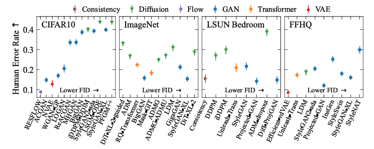

# FD-DINOv2 Evaluation Score in Pytorch


This is an unofficial pytorch implementation of the following paper:

Stein, George, et al. "[Exposing flaws of generative model evaluation metrics and their unfair treatment of diffusion models](https://arxiv.org/abs/2306.04675)." *Advances in Neural Information Processing Systems* 36 (2024).

|  |
|:--:| 
| *The investigation by **Layer 6 AI** reveals that diffusion models create more realistic and diverse images, according to human judgment, compared to GANs. However, they receive lower scores on metrics using the Inception-V3 network, indicating a bias in the evaluation method.* |
> FD(**Fréchet Distance**) is a measure of similarity between two datasets of images.
It was shown to correlate well with human judgement of visual quality and is most often used to evaluate the quality of samples of Generative Adversarial Networks.

FID(**Fréchet Inception Distance**), which has been widely used as a metric for evaluating image quality generated by generative models(e.g. GANs or diffusion models), is calculated by computing the [Fréchet distance](https://en.wikipedia.org/wiki/Fr%C3%A9chet_distance) between two Gaussians fitted to feature representations of the Inception network.

However, the authors of [Exposing Flaws](https://arxiv.org/abs/2306.04675) figure out Fréchet distance using DINOv2-ViT-L/14, namely [FD-DINOv2](https://github.com/justin4ai/FD-DINOv2), allows for much richer evaluation of generative models compared to FID. Please refer to the paper for more details.

## Installation

Requirements:

- python3
- pytorch
- torchvision
- pillow
- numpy
- scipy

This work is quite insensitive to package versions. I will provide the information of the stable versions and the corresponding Docker environment soon.

## Preparation

Required image folder structure is as follows:


```
.
├── fake
│   ├── samples_17867.png
│   ├── samples_17868.png
│   ├── ...
│   ├── samples_17870.png
│   ├── samples_17871.png
│   └── samples_17872.png
└── real
    ├── 01155.jpg
    ├── 01156.jpg
    ├── ...
    ├── 01158.jpg
    └── 01159.jpg
```

Note you are supposed to place more than 2048 images for each dataset for the accurate evaluation scores.


## Usage

To compute the FD-DINOv2 score between two datasets, please run:
```
python3 ./src/pytorch_fd/fd_score.py {GENERATED_IMGS_PATH} {REAL_IMGS_PATH}
```


## References
The code is built on [pytorch-fid](https://github.com/mseitzer/pytorch-fid) for calculating Fréchet Distance. In order to adopt DINOv2 model instead of Inception module, I referreed to [dinov2](https://github.com/facebookresearch/dinov2) from Facebook.

## To-Do

- [ ] Provide the Docker environment
- [ ] Release Gradio demo

## Citation

If you use this repository in your research, consider citing it using the following Bibtex entry:

```
@misc{Justin2024fddino,
  author={Junyeong Ahn},
  title={{FD-DINOv2: FD Score via DINOv2}},
  month={June},
  year={2024},
  note={Version 0.1.0},
  howpublished={\url{https://github.com/justin4ai/FD-DINOv2}},
}
```
